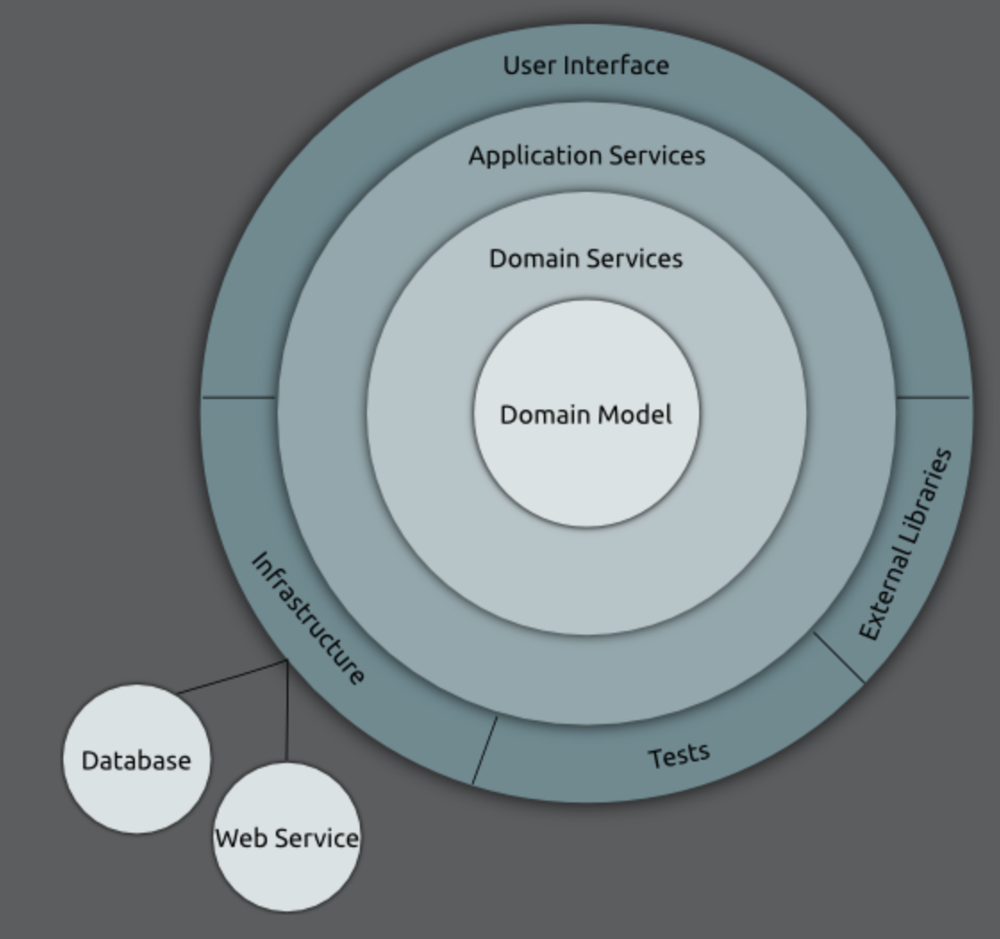

# onion_architecture
 

 

[Getting Started](#getting-started)
 
[Domain Model](#domain-model)
 
[Domain Service](#domain-service)
 
[Application Service](#application-service)
 
[User Interface](#user-interface)
 
[Infrastructure](#infrastructure)
 
[External Libraries](#external-libraries)
 
[Tests](#tests)

### Getting Started 

Always start building your application from the core (Domain Model) and work outwards towards the outer layers (Infrastructure).

### Domain Model

This layer contains pure models & entities, They interact with each other and nothing else.

### Domain Service

These are things like:

<ul>
 <li>Factories</li>
 <li>Repositories</li>
 <li>Other services that use the core domain model</li>
</ul>

The Domain Model & Domain Service make up the core/business logic.

### Application Service

In traditional MVC, this is your controller layer.

<ul>
 <li>it's also the router</li>
 <li>it may use other application services e.g (authentication, data parsers, translators)</li>
</ul>

Nothing in the application should depend on this layer, it must be swappable!

### User Interface

The UI has nothing dependent upon it, but is dependent on every deeper layer.

### Infrastructure

This layer is important, it provides for our domain.

It uses data sources like:

<ul>
 <li>Databases</li>
 <li>Web services (API's)</li>
</ul>

They are used by infrastructure but aren't part of our onion.

They are simply data providers, The infrastructure relies on the Domain Services & Domain Models.

The infrastructure also relies upon the Application Service layer.

### External Libraries

They sit outside the onion and are used similar to the infrastructure by the application layer.

Some libraries include:

<ul>
 <li>Google maps API</li>
 <li>Facebook API</li>
</ul>

### Tests

These sit outside the onion, the application should never rely on the tests to properly function.
